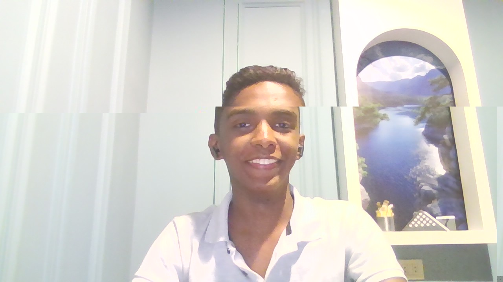

<p align="center">
  
</p>

# Shade: Fully Automatic Censorship Removal

<p align="center">
  <a href="https://assem.cloud/"></a>
  <a href="https://x.com/assemsabryy"></a>
  <a href="https://www.facebook.com/assemsabryy"></a>
  
  
</p>

---

## 👤 The Visionary Behind Shade

<p align="center">
  
  <br>
  <b>Assem Sabry</b>
  <br>
  <i>Lead Developer & AI Researcher</i>
</p>

---

## 🌟 What is Shade?

**Shade** is a state-of-the-art tool designed to remove "safety alignment" (censorship) from transformer-based language models without the need for expensive post-training or fine-tuning. 

By leveraging an advanced implementation of **directional ablation** (also known as "abliteration") combined with a **TPE-based parameter optimizer** powered by [Optuna](https://optuna.org/), Shade achieves surgical precision in neutralizing refusal mechanisms while preserving the model's core intelligence.

### 🚀 Key Highlights
*   **100% Automatic**: No deep knowledge of transformer internals required.
*   **Minimal IQ Loss**: Co-minimizes refusals and KL divergence for maximum performance.
*   **Fast & Efficient**: Process models in minutes, not hours or days.
*   **Broad Support**: Compatible with Llama, Qwen, Gemma, Mistral, and many MoE architectures.

---

## 📊 Performance Benchmarks

Shade doesn't just work—it excels. In a comparison with expert-tuned manual abliterations, Shade's automatic process produces superior results:

| Model | Refusals (Harmful) | KL Divergence (Lower is Better) |
| :--- | :---: | :---: |
| [google/gemma-3-12b-it](https://huggingface.co/google/gemma-3-12b-it) (Original) | 97/100 | 0.00 |
| Manual Abliteration V2 | 3/100 | 1.04 |
| **Shade (Fully Automatic)** | **3/100** | **0.16** |

---

## 🛠️ Getting Started

### Installation
```bash
pip install -U shade-ai
```

### Basic Usage
To decensor a model, simply run:
```bash
shade <model_name_or_path>
```
*Example:* `shade Qwen/Qwen3-4B-Instruct-2507`

### Advanced Configuration
Shade is highly configurable. Run `shade --help` or check out [`config.default.toml`](config.default.toml) for more options like:
*   `--quantization bnb_4bit`: Run on consumer hardware with 4-bit quantization.
*   `--plot-residuals`: Visualize exactly how the model's internal state changes.

---

## 🔬 Research & Interpretability

Shade is also a powerful research tool. By installing the research extra:
```bash
pip install -U shade-ai[research]
```

You can generate **residual vector plots** and animations that show how information transforms between transformer layers.

<p align="center">
  <br>
  <i>Visualization of residual space transformation</i>
</p>

---

## 🧠 How It Works

Shade identifies the "refusal direction" within the model's high-dimensional space and applies an **Ablation Weight Kernel**. This kernel is optimized specifically for each component (Attention Out-Projection, MLP Down-Projection) to ensure that the censorship is removed with the least amount of "collateral damage" to the model's capabilities.

---

## ⚠️ Disclaimer

**Assem Sabry**, the developer of Shade, is **not responsible** for any misuse of this tool. Shade is provided for educational and research purposes only. The primary goal of this project is to allow users to unlock the full potential of open-source language models and to study their internal mechanics without artificial constraints. Users are expected to interact with de-censored models responsibly.

---

## 📜 Citation

If you use Shade in your research, please cite it:

```bibtex
@misc{shade,
  author = {Sabry, Assem},
  title = {Shade: Fully automatic censorship removal for language models},
  year = {2026},
  publisher = {GitHub},
  journal = {GitHub repository},
  howpublished = {\url{https://github.com/AssemSabry/Shade}}
}
```

---

## ⚖️ License

Copyright &copy; 2026 **Assem Sabry**

Licensed under the **GNU Affero General Public License v3.0**. See the [LICENSE](LICENSE) file for details.
