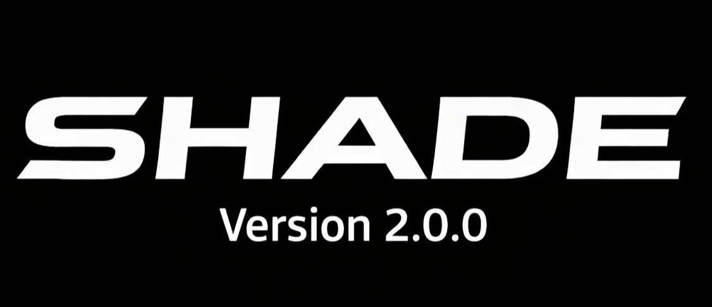

# Shade v2.0.0 Features
## Fully Automatic Censorship Removal for Large Language Models

**Shade AI** is a state-of-the-art tool designed to liberate Large Language Models (LLMs) from artificial censorship and safety filters using advanced **Abliteration** techniques. Unlike traditional fine-tuning, Shade analyzes the model's internal residual stream to identify and neutralize "refusal" directions, restoring the model's original ability to follow instructions without damaging its core logic or intelligence.

---

## 🚀 New in Version 2.0.0 (The Ultimate Update)

The v2.0.0 release transforms Shade from a CLI utility into a complete **Model Liberation Platform**.

- **Ollama One-Click Integration**: Automatically register your uncensored models with Ollama. No manual Modelfile creation needed.
- **Model Quality Benchmarking**: Built-in "Sanity Check" system to verify model intelligence after censorship removal.
- **Space Optimizer (Prune)**: Deep clean temporary files, checkpoints, and heavy Hugging Face cache with a single command.
- **Proactive Core (Doctor ++)**: A self-healing diagnostic system that can auto-install missing dependencies (CUDA helpers, web servers, etc.).
- **Official API & Web Backend**: Ready-to-use FastAPI server with CORS support for React, Flutter, and external frontend integrations.

---

## 🛠 Core Features

### 1. Fully Automated Abliteration
- **No Training Required**: Uses mathematical projection to remove censorship without expensive GPU fine-tuning.
- **Smart Layer Analysis**: Automatically identifies which layers are responsible for refusals.
- **Precision Optimization**: Balances removal of safety filters with the preservation of model intelligence (KL Divergence tracking).

### 2. High-End Web Interface (Shade Web UI)
- **Modern Liquid Glass Design**: A premium, responsive web chat interface built using 2026 design aesthetics.
- **Model Comparison Mode**: View original vs. uncensored responses side-by-side to see the real difference.
- **Localhost Powered**: Runs entirely on your machine. Your chats never leave your local network.

### 3. Advanced Model Management
- **Persistent Model Library**: Save multiple "Trial" versions of your models with unique names.
- **Selective Download**: Download only specific versions (e.g., GGUF 6-bit) using pattern matching to save bandwidth and disk space.
- **Safe Serialization**: Optimized for Safetensors, ensuring the highest performance and safety for your model files.

### 4. Developer Tools & API
- **Full API Access**: Standardized endpoints (`/chat`, `/compare`, `/info`) for building your own apps.
- **CORS Enabled**: Ready to be used as a backend for your custom React or Flutter mobile apps.
- **CLI Commands Manual**: A comprehensive, beautifully formatted command table built into the terminal (`shade commands`).

### 5. Hardware & System Care
- **Multi-GPU Support**: Automatically detects and leverages CUDA, XPU, MLU, and Apple Metal (MPS).
- **GPU Diagnostics**: Real-time VRAM and hardware capability monitoring.
- **Expandable Segments**: Optimized memory management to prevent "Out-of-Memory" (OOM) errors during heavy processing.

---

## 📋 Command Reference Summary

| Command | Description |
| :--- | :--- |
| `shade <model_id>` | Start the automatic optimization & abliteration process. |
| `shade serve` | Launch the Shade Web UI interface. |
| `shade library` | Manage and launch your saved decensored models. |
| `shade ollama` | Export and register a model with Ollama automatically. |
| `shade benchmark` | Run quality tests to ensure the model's logic is intact. |
| `shade doctor --fix` | Automatically diagnose and fix system/dependency issues. |
| `shade prune --all` | Free up disk space by cleaning cache and checkpoints. |
| `shade hf login` | Securely authenticate with Hugging Face Hub. |

---

## 🛡 License & Safety
Shade is licensed under **AGPL-3.0-or-later**. 
*Note: This tool is intended for research and personal use. Always respect the original model creators' terms of service.*

**Developed by Assem Sabry | 2026**
